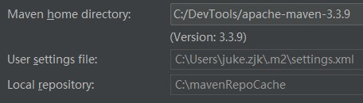

# windows setup
- 桌面右击，显示设置-高级显示设置-文本和其他项目大小调整的高级选项-仅更改文本大小，统一加4个点

# IDE
## terminal:
- C:\cygwin64\bin\mintty.exe

## git:
- C:\cygwin64\bin\git.exe

## default settings:
- maven 3.3.9
- config.xml path
- cache path



## default Project Structure:
- level: 1.8, 8
- SDKs: jdk 1.6, 1.8

## plugins:
- Lombok Plugin
- SonarLint
- Open in terminal
- Open Terminal Here

# Windows Environment
```bash
PATH
C:\cygwin64\bin\
C:\DevTools\apache-maven-2.2.1\bin
C:\Program Files\Java\jdk1.6.0\bin
C:\Program Files\Java\jdk1.8.0\bin
%JAVA_HOME%\bin;%JAVA_HOME%\jre\bin;%M2_HOME%\bin;

JAVA_HOME
C:\Program Files\Java\jdk1.6.0

CLASSPATH
.;%JAVA_HOME%\lib\dt.jar;%JAVA_HOME%\lib\tools.jar

M2_HOME
C:\DevTools\apache-maven-2.2.1

M2_REPO
C:\mavenRepoCache

ECLIPSE_HOME
C:\DevTools\eclipse
```

## java config:
- remove dir C:\ProgramData\Oracle\Java\javapath
- PATH-C:\Program Files\Java\jdk1.6.0\bin
- HKEY_LOCAL_MACHINE-'Software\JavaSoft\Java Runtime Environment\CurrentVersion'

## other arguments
```bash
添加虚拟机参数
-XX:PermSize=64M -XX:MaxPermSize=256M
-Dpandora.location=D:\hsf\2_5_150420\taobao-hsf.sar
-Dhotcode.base=D:\Repositories\tosp-userface\tosp-userface\tosp-userface-web

clean package -Dmaven.test.skip

-XX:PermSize=64M
-XX:MaxPermSize=256M
-Dpandora.location=D:/hsf/2.1.0.7/taobao-hsf.sar
-Dhotcode.base=D:/Repositories/tosp-userface/tosp-userface/tosp-userface-web
-Dhotcode.confFile=D:/Repositories/tosp-userface/tosp-userface/tosp-userface-web/workspace.xml
```

# tools
- 绿色版软件（Xshell）需要安装微软VC运行库，尽量在刚开机的时候安装，装完重启下，link:待上传
- updating：xmind
- specials：Xshell、astash、Axure、idea15、jdk8u20
- cygwin，subversion，git，tortoiseSVN, tortoiseGit
